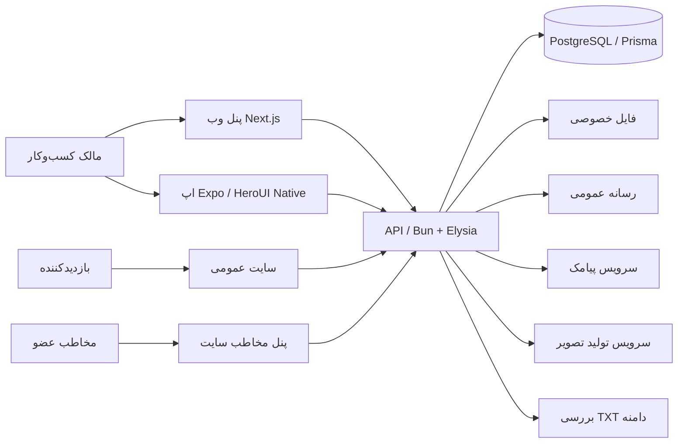
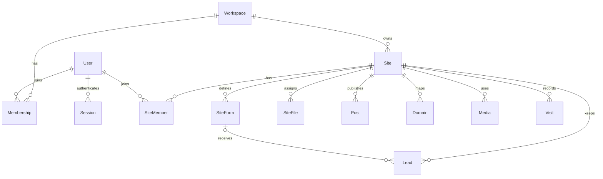

# معماری محصول و سامانه آرا‌لند

تاریخ: ۶ سپتامبر ۲۰۲۶. این سند ساختار نسخه نخست، تصمیم‌های فعلی و مرزهای استقرار را توضیح می‌دهد. [برنامه اجرا](PLAN.md)، [تحقیق بازار](RESEARCH.md)، [قرارداد API](API-CONTRACT.md) و [نقشه راه](ROADMAP.md) مکمل آن هستند. وجود کد یا موفقیت build معادل آزمون سرویس پولی، اتصال دامنه عمومی یا انتشار اپ در فروشگاه نیست.

## محصول و نقش‌ها

آرا‌لند یک خدمت چندمشتری برای ساخت سایت کسب‌وکار است. مالک، سایت را از اپ گوشی یا پنل وب مدیریت می‌کند؛ بازدیدکننده صفحه عمومی را می‌بیند؛ مخاطب ثبت‌نام‌کرده وارد پنل اختصاصی همان سایت می‌شود و فایل تخصیص‌یافته به خودش را دریافت می‌کند.

| نقش | کارهای اصلی | مرز دسترسی فعلی |
| --- | --- | --- |
| مهمان محصول آرا‌لند | دیدن داشبورد نمونه و پنج قالب، ورود با شماره موبایل | محتوای نمونه از داده واقعی جداست؛ تغییر پایدار نیازمند ورود است. |
| مالک کسب‌وکار | ساخت چند سایت، تغییر بخش/قالب، انتشار، فرم و مخاطب، مقاله، تصویر، فایل، دامنه و SEO | عضویت `OWNER` در فضای کاریِ سایت در سرور بررسی می‌شود. |
| بازدیدکننده سایت | دیدن صفحه/مقاله منتشرشده، ارسال فرم، مشاهده استوری و پست انتخابی | محتوای پیش‌نویس، فایل اختصاصی، پاسخ‌های دیگران و اطلاعات مدیریت عمومی نیستند. |
| مخاطب ثبت‌نام‌کرده | احراز شماره، عضویت در سایت مشخص، دریافت فایل خودش | داشتن نشست عمومی کافی نیست؛ عضویت در همان سایت و تطابق شماره گیرنده لازم است. |
| اپراتور زیرساخت | تنظیم سرویس‌ها، استقرار، پشتیبان‌گیری، بررسی رخداد و هزینه | پنل عمومی پشتیبانی/مدیرکل یا امکان impersonation در نسخه فعلی تعریف نشده است. |
| همکار، ویرایشگر و مدیر آژانس | نقش‌های پیشنهادی برای رشد تیم | هنوز گردش دعوت، سطح دسترسی محدود یا تأیید انتشار پیاده نشده؛ نقش فعلی سمت سرور `OWNER` است. |

یک شخص می‌تواند هم مالک یک فضای کاری و هم مخاطب سایت دیگری باشد. **هویت شماره موبایل، عضویت مدیریتی و عضویت مخاطب سه مفهوم جدا هستند.** ارسال فرم به تنهایی احراز شماره یا عضویت در پنل نیست؛ `Lead` با `SiteMember` فرق دارد.

## اجزای مونوریپو

| مسیر | مسئولیت | فناوری |
| --- | --- | --- |
| `apps/api` | اعتبارسنجی، احراز هویت، مجوزها، عملیات محتوا، فرم، فایل، دامنه و سرویس‌ها | Bun، Elysia، TypeBox، Sharp |
| `apps/web` | داشبورد فارسی، ویرایشگر، نمایش قالب و صفحه عمومی/پنل مخاطب | Next.js App Router، React، HeroUI 3، Tailwind 4 و CSS |
| `apps/mobile` | اپ مدیریت گوشی، ذخیره امن نشست و جریان‌های بومی | Expo، React Native، HeroUI Native، Uniwind، SecureStore |
| `packages/shared` | مدل‌های TypeScript، انواع بخش‌ها، قالب‌های اولیه و کلاینت API | TypeScript |
| `packages/db` | مدل‌های رابطه‌ای، Prisma Client، migration و seed | Prisma، PostgreSQL |
| `docs` | دامنه محصول، تحقیق، تصمیم‌ها، قرارداد و برنامه توسعه | Markdown |

وب و موبایل از داده و قرارداد مشترک استفاده می‌کنند. کامپوننت DOM سایت عمومی در React Native اجرا نمی‌شود؛ HeroUI Native برای محیط بومی است. Next.js به صفحه عمومی HTML قابل ایندکس و متادیتای مستقل می‌دهد؛ Bun/Elysia مرجع نهایی مجوز و ذخیره داده است. هیچ تصمیم دسترسی نباید فقط بر مخفی‌شدن دکمه در رابط تکیه کند.



## مدل داده موجود

مرجع اجرایی مدل، `packages/db/prisma/schema.prisma` است؛ انواع سمت رابط، نمایش عمومی محدودشده‌ای از همان مدل هستند.

| مدل | اطلاعات کلیدی | رابطه و قید مهم |
| --- | --- | --- |
| `User` | موبایل نرمال‌شده، نام اختیاری | موبایل یکتا؛ چند نشست، عضویت فضای کاری و عضویت سایت |
| `Workspace` | نام فضای کاری | چند عضویت و چند سایت |
| `Membership` | کاربر، فضای کاری، نقش | زوج کاربر/فضا یکتا؛ مالکیت سایت از این رابطه محاسبه می‌شود. |
| `OtpChallenge` | شماره، هش کد، انقضا، شمار تلاش، مصرف‌شدن | شناسه UUID؛ ایندکس شماره/زمان؛ خود کد ذخیره نمی‌شود. |
| `Session` | هش توکن، کاربر و زمان انقضا | هش توکن یکتا؛ توکن خام در DB ذخیره نمی‌شود. |
| `Site` | نام، slug، قالب، پیش‌نویس و snapshot صفحهٔ اصلی/صفحه‌های مستقل/منوها، SEO | slug سایت سراسری یکتا؛ slug هر صفحه در همان سایت یکتا؛ وابسته به یک فضای کاری |
| `SiteForm` | عنوان و آرایه فیلدهای فرم | وابسته به سایت؛ هر فیلد شناسه یکتا در همان فرم دارد. |
| `Lead` | عنوان فرم هنگام دریافت، مقدار فیلدها و زمان | وابسته به سایت؛ پس از حذف فرم، پاسخ‌ها با `formId=null` باقی می‌مانند. |
| `SiteMember` | کاربر و سایت | زوج کاربر/سایت یکتا؛ مخاطب می‌تواند عضو چند سایت باشد. |
| `SiteFile` | عنوان، نام اصلی، نوع، اندازه، کلید ذخیره، موبایل گیرنده | ایندکس سایت/شماره؛ کلید ذخیره یکتا و غیرقابل انتخاب توسط کاربر |
| `Post` | عنوان، slug، خلاصه، متن، تصویر و وضعیت انتشار | زوج سایت/slug یکتا؛ انتشار مقاله مستقل از انتشار صفحه است. |
| `Domain` | hostname، توکن تأیید و وضعیت | hostname سراسری یکتا؛ وضعیت فعلی فقط `PENDING` و `VERIFIED` |
| `Media` | کلید ذخیره، ابعاد، اندازه و فرمت خروجی | تصویر عمومیِ وابسته به سایت؛ کلید ذخیره یکتا |
| `Visit` | سایت و زمان | شمارش ساده رویداد بازدید؛ شناسه بازدیدکننده، UTM یا fingerprint ندارد. |



فایل فعلاً به **شماره تأییدشده گیرنده** تخصیص داده می‌شود و می‌تواند پیش از عضویت او بارگذاری شود. پس از ورود و عضویت، همان شماره فایل را می‌بیند. برای تغییر شماره، انتقال حساب، واگذاری مجدد سیم‌کارت و لغو دسترسی به فایل، سیاست محصول و مدل قوی‌تری در نقشه راه لازم است؛ endpoint تغییر شماره در نسخه فعلی وجود ندارد.

## چرخه محتوا و انتشار

۱. ساخت سایت، فضای کاری مالک را پیدا یا ایجاد می‌کند؛ یک پیش‌نویس از قالب و یک فرم مشاوره اولیه ساخته می‌شود. سایت ابتدا `DRAFT` است.
۲. ویرایش مالک، `draft` و تنظیمات نام/SEO را تغییر می‌دهد. `draft.sections` صفحهٔ اصلی است؛ `draft.pages` صفحه‌های مستقل عمومی، خدمت و موضوع را با عنوان، آدرس، SEO، وضعیت فعال‌بودن و بخش‌های خودشان نگه می‌دارد. برند و قالب بین همهٔ صفحه‌ها مشترک‌اند. `draft.navigation` فهرست مرتب لینک‌های بالا و پایین سایت است. سرور شناسه و آدرس تکراری، URL نامعتبر و ارجاع به صفحه یا بخش ناموجود را رد می‌کند.
۳. انتشار، محتوای اصلی، همهٔ صفحه‌ها، SEO صفحه‌ها و منوها را در یک snapshot JSON در `published` ذخیره می‌کند؛ شناسه قالب، نام سایت و SEO سایت نیز در همان عملیات به `publishedTemplateId`، `publishedName` و `publishedSeo` کپی می‌شوند. سایت `PUBLISHED` و زمان انتشار ثبت می‌شود. صفحه‌ها انتشار مستقل ندارند.
۴. پاسخ عمومی فقط snapshot منتشرشده را برمی‌گرداند و صفحه‌های غیرفعال، لینک‌های مقصد آن‌ها و لینک منو به بخش اصلی غیرفعال را کنار می‌گذارد. برای سازگاری نوع مشترک، فیلد `draft` پاسخ عمومی نیز به همین محتوای منتشرشدهٔ پالایش‌شده اشاره می‌کند؛ پیش‌نویس واقعی و شناسه فضای کاری ارسال نمی‌شود. مسیر عمومی صفحهٔ غایب یا غیرفعال ۴۰۴ است؛ فعال‌بودن صفحه الزاماً به معنی نمایش آن در منو نیست.
۵. تغییر قالب، **بخش‌های صفحهٔ اصلی پیش‌نویس را با محتوای اولیه قالب جایگزین می‌کند** و نام سایت، صفحه‌های اضافه و منوهای معتبر را نگه می‌دارد؛ لینک منو به بخش اصلی حذف‌شده کنار گذاشته می‌شود و snapshot قبلی عمومی باقی می‌ماند. حفظ خودکار تمام محتوای سفارشی صفحهٔ اصلی در تغییر قالب هنوز وجود ندارد و رابط باید این اثر را پیش از عمل روشن کند.

صفحه‌های مستقل داخل ستون‌های JSON موجود قرار دارند و برای این توسعه جدول یا migration جدیدی لازم نیست. نبود `pages` یا `navigation` در دادهٔ قدیمی معتبر است؛ نبود منو رفتار قبلی قالب را حفظ می‌کند و منوی صریحاً خالی انتخاب مالک است. تا ۵۰ صفحهٔ اضافه، ۴۰ بخش در هر صفحه و ۱۰۰ لینک در هر منو پذیرفته می‌شود. آدرس صفحه یک قطعهٔ انگلیسیِ حروف کوچک/عدد/خط تیره و یکتا در سایت است. شناسهٔ ثابت صفحه مقصد لینک کارت خدمت، دکمه و منو است؛ تغییر آدرس آن لینک‌ها را به مقصد جدید می‌برد، اما لینک خارجی قدیمی پس از انتشار ۴۰۴ می‌شود. حذف صفحه باید ارجاع‌های وابستهٔ پیش‌نویس را هم پاک کند. [برنامه و معیارهای پذیرش چندصفحه‌ای](MULTI-PAGE-PLAN.md) جزئیات این تصمیم‌ها را ثبت می‌کند.

فرم‌ها و مقاله‌ها بیرون از snapshot صفحه‌اند: ساخت/حذف فرم فوراً روی فرم‌های قابل انتخاب سایت فعال اثر دارد؛ مقاله فقط با `published=true` عمومی می‌شود. انتشار دوباره صفحه، شرط تغییر این دو نیست. در نتیجه عبارت «هر تغییر فقط با انتشار سایت زنده می‌شود» برای همه بخش‌های مدیریتی دقیق نیست. انتشار زمان‌بندی‌شده، تاریخچه، بازگردانی نسخه و ذخیره با کنترل تعارض از توسعه‌های بعدی‌اند.

## جریان احراز هویت و مجوز

- شماره ایران با ارقام فارسی/عربی و قالب‌های رایج به `+989…` نرمال می‌شود.
- درخواست OTP یک چالش تصادفی با انقضای ۱۸۰ ثانیه می‌سازد. کد با HMAC ذخیره، شمار تلاش حداکثر ۵ و مصرف موفق اتمیک است. کد مصرف‌شده قابل تکرار نیست.
- محدودیت درخواست برای شماره و IP وجود دارد؛ بخشی در حافظه پردازش و بخشی بر تعداد چالش‌های DB متکی است. محدودیت حافظه‌ای برای استقرار چندنمونه‌ای کافی نیست.
- نشست، توکن تصادفی ۳۲ بایتی با عمر ۳۰ روز دارد؛ API هش آن را نگه می‌دارد. endpoint خروج نشست فعلی را باطل می‌کند. رابط باید این endpoint را هنگام خروج فراخوانی کند.
- اپ از SecureStore سیستم‌عامل استفاده می‌کند. کلاینت وب فعلی bearer را در localStorage نگه می‌دارد؛ برای استقرار عمومی باید تصمیم کوکی `HttpOnly/Secure/SameSite`، BFF یا سخت‌سازی CSP/XSS بررسی شود. هیچ کلید SMS یا AI در کلاینت قرار نمی‌گیرد.
- حالت توسعه فقط با `AUTH_DEV_MODE=true` پاسخ `devCode` می‌دهد؛ در `NODE_ENV=production` روشن‌بودن آن ممنوع است. secret تولید باید دست‌کم ۳۲ کاراکتر داشته باشد.

عملیات مدیریت سایت به مالک workspace محدود است. دریافت فایل برای مالک یا مخاطبی مجاز است که هم عضو سایت فایل باشد و هم شماره‌اش با گیرنده تطابق داشته باشد. نتیجه عدم مجوز، ۴۰۱/۴۰۳ یا ۴۰۴ مناسب است؛ هیچ fallback به داده نمونه نباید با برچسب داده واقعی نمایش داده شود.

## فایل، رسانه و سرویس‌های خارجی

**فایل خصوصی:** multipart به API فرستاده می‌شود؛ حد فعلی ۲۰ مگابایت است. نام ذخیره‌شده UUID سرور است و پوشه خصوصی از static hosting ارائه نمی‌شود. دانلود از endpoint احراز هویت‌شده با `attachment`، `no-store` و `nosniff` انجام می‌شود. این‌ها جای اسکن بدافزار، سهمیه، revoke، audit دانلود، نگهداری قابل تنظیم و بکاپ را نمی‌گیرند.

**تصویر عمومی:** حداکثر ورودی ۱۲ مگابایت؛ JPEG/PNG/WebP/AVIF توسط Sharp خوانده، جهت تصویر اصلاح، ابعاد حداکثر ۲۰۰۰ پیکسل و خروجی WebP با کیفیت ۸۲ تولید می‌شود. محدودیت تعداد پیکسل ورودی اعمال می‌شود. رسانه عمومی عمداً قابل دریافت بدون نشست و قابل cache است؛ سند مشتری نباید در این مسیر بارگذاری شود. نسخه اصلی تصویر در مدل فعلی جداگانه نگهداری نمی‌شود.

**AI:** adapter سرور، تولید یک تصویر را از سرویس پیکربندی‌شده درخواست می‌کند و خروجی را از مسیر بهینه‌سازی رسانه عبور می‌دهد. نبود کلید یا شکست سرویس، خطای واقعی می‌دهد. generation هم‌زمان در درخواست HTTP اجرا می‌شود؛ queue، job قابل پیگیری، سهمیه مالی، لغو، بازیابی پس از قطع ارتباط و ثبت provenance هنوز نیاز تولید هستند. بررسی و انتخاب تصویر قبل از استفاده بر عهده مالک است.

**SMS:** adapter Kavenegar با کلید و template تأییدشده قابل تنظیم است. پاسخ موفق API تأمین‌کننده با آزمون تحویل روی گوشی یکسان نیست؛ اعتبار، الگوی پیام و تحویل واقعی باید هنگام پایلوت بررسی شوند.

**اینستاگرام:** نسخه نخست محتوای انتخابی مالک و لینک پست را نمایش می‌دهد. نگهداری token OAuth، sync دوره‌ای و مدیریت اتصال حساب Instagram در مدل جاری وجود ندارد. این قابلیت نباید در محصول به عنوان feed خودکار معرفی شود.

## دامنه اختصاصی

مالک دامنه را ثبت می‌کند و برای `_araland.example.com` یک رکورد TXT با مقدار دقیق زیر می‌سازد:

```text
araland-verification=TOKEN
```

`TOKEN` همان `verificationToken` برگشتی دامنه است؛ **قرار دادن توکن خام بدون پیشوند، تأیید نمی‌شود.** سرور رکورد TXT را می‌خواند و فقط در تطابق دقیق، وضعیت را `VERIFIED` می‌کند. lookup عمومی دامنه فقط دامنه تأییدشده متعلق به سایت منتشرشده را به slug وصل می‌کند.

این وضعیت، مالکیت DNS را نشان می‌دهد. `A/CNAME`، دسترس‌پذیری واقعی host، گواهی TLS، تمدید و تشخیص خطای edge از همین وضعیت نتیجه نمی‌شوند. کد Next proxy اکنون host مشتری را با lookup تأییدشده تطبیق می‌دهد و مسیر صفحهٔ اصلی، صفحه‌های مستقل `/:pageSlug`، بلاگ و پنل همان سایت را بازنویسی می‌کند؛ backend نیز origin دامنه تأییدشده سایت منتشرشده را برای CORS مجاز می‌کند. این کد به DNS و HTTPS استقرار واقعی نیاز دارد. برای تولید به وضعیت‌های جدا مانند `DNS_PENDING`، `TLS_PENDING`، `ACTIVE` و `ERROR` نیاز داریم. بازپس‌گیری دامنه‌ای که شخص دیگری بدون تأیید ثبت کرده، انقضای claim، حذف/جابه‌جایی دامنه و بررسی مجدد مالکیت باید پیش از عرضه گسترده طراحی شود.

در محیط توسعه مسیر معتبر سایت `http://localhost:3000/s/SLUG` است. زیردامنه‌ای مانند `SLUG.araland.site` تا پیکربندی wildcard DNS و edge، صرفاً پیشنهاد ساختار آدرس است و نباید به عنوان آدرس فعال به مالک وعده داده شود.

## مرز نسخه نخست و تولید

| حوزه | موجود در کد/قرارداد | نیاز پیش از استفاده عمومی پایدار |
| --- | --- | --- |
| چندمشتری و auth | رابطه workspace، مجوز مالک، OTP/نشست و کنترل فایل | بررسی امنیتی، rate limit مشترک، cleanup، سیاست بازیابی حساب و hardening وب |
| تجربه ساخت سایت | پنج قالب واقعی، schema بخش و snapshot انتشار | آزمون دستگاه، کنترل تعارض و تاریخچه نسخه‌ها |
| فرم و ارتباط | ثبت پاسخ، فهرست مخاطب/عضو، فایل اختصاصی و endpoint ویرایش فرم | یکپارچه‌سازی/QA ویرایش فرم در رابط، وضعیت پیگیری، یادداشت، رضایت ارتباط، pagination و پیام/تیکت |
| محتوا | ساخت/ویرایش/حذف مقاله در API، FAQ و استوری مبتنی بر بخش | یکپارچه‌سازی/QA ویرایش مقاله در رابط، زمان‌بندی، دسته/برچسب، RSS و مدیریت رسانه کامل |
| آمار | بازدید، پاسخ، عضو و نسبت ساده؛ سری ۷روزه | بازدید یکتا، تعریف تبدیل، attribution و eventهای تجاری؛ نمودار نمایشی داده واقعی محسوب نشود. |
| ذخیره‌سازی | فایل محلی با نام امن و Sharp | storage پایدار، object storage، بازیابی، CDN و اسکن/سهمیه |
| پیامک و AI | adapter واقعی و خطای صریح | حساب معتبر، تست واقعی، metering، queue و کنترل هزینه |
| دامنه | ثبت، TXT، lookup تأییدشده، Next host proxy و CORS پویا | DNS مقصد، HTTPS و تمدید، آزمون دامنه واقعی، وضعیت سلامت و رسیدگی به claim |
| اپ بومی | پروژه Expo/HeroUI و جریان‌های مدیریت؛ بسته‌های Hermes | smoke test دستگاه، signed build، QA دسترس‌پذیری/کیبورد و انتشار فروشگاهی |
| مدل درآمد | زیرساخت مدیریت سایت | plan، اشتراک، پرداخت، سهمیه، صورتحساب و گردش لغو/تمدید |

جزئیات فعلی API در [README بک‌اند](../apps/api/README.md) و اپ در [README موبایل](../apps/mobile/README.md) آمده‌اند. نتیجه نهایی build، آزمون مرورگر و دستگاه باید در گزارش تحویل ثبت شود؛ این سند مدرک اجرای آزمون خارجی نیست.

## استقرار پیشنهادی پایلوت

یک سرویس Next.js برای وب، یک سرویس Bun/Elysia برای API، PostgreSQL با volume پایدار و backup، storage فایل جدا و reverse proxy با HTTPS. در اولین پایلوت یک instance API باعث ساده‌ترشدن محدودیت‌های حافظه‌ای می‌شود؛ انتقال به چند instance نیازمند limiter و queue مشترک است. مسیر داده باید از مسیر release کد جدا باشد تا deploy موجب از دست رفتن فایل نشود.

دامنه origin وب و API، `CORS_ORIGINS` و `API_PUBLIC_URL` باید هماهنگ باشند. روی گوشی واقعی `localhost` به گوشی اشاره می‌کند؛ آدرس LAN برای توسعه و HTTPS عمومی برای تولید لازم است. خطای credential یا DNS باید در رابط قابل تشخیص باشد؛ providerهای فعال‌نشده نباید موفقیت ساختگی برگردانند.

حداقل مشاهده‌پذیری شامل health اتصال DB، خطای 5xx، زمان پاسخ، شکست OTP/AI، نرخ رد دسترسی، ظرفیت فایل و روند هزینه است. محتوای فایل، شماره کامل، کد OTP و کلید سرویس در log عمومی نباید ثبت شوند. برای DB و فایل، آزمون restore از backup بخشی از پذیرش است؛ صرف داشتن backup job کافی نیست.

## معیارهای یکپارچه‌سازی و آزمون

تست‌های API موجود، نرمال‌سازی شماره، انقضای OTP/تلاش/مصرف هم‌زمان، جداسازی مالک‌ها، snapshot قالب و محتوا، URLهای نامعتبر، فرم و مقاله، فایل گیرنده، بهینه‌سازی تصویر و دامنه تأییدنشده را هدف گرفته‌اند. این پوشش باید با موارد UI تکمیل شود:

- ساخت مقاله بدون تصویر اختیاری، CTA تلفن/ایمیل، کپی مقدار کامل TXT و تطابق محدودیت فایل با API.
- تغییر سریع سایت در پنل بدون نمایش پاسخ دیررس سایت قبلی؛ load، خطا و صفر از هم تفکیک شوند.
- ورود/خروج واقعی و ابطال نشست؛ عدم دسترسی به فایل با هویت دیگر و پس از خروج.
- جابه‌جایی/حذف بخش، انتشار و مشاهده نتیجه؛ برچسب «ثبت نشده» و «منتشر نشده» صحیح باشد.
- modal و story با focus اولیه، Escape، محصورشدن focus و بازگشت به کنترل بازکننده؛ label ورودی و منوی موبایل با وضعیت قابل خواندن.
- عرض ۳۶۰ و ۱۴۴۰، صفحه‌کلید، متن فارسی بلند، عدد/URL مختلط، بزرگ‌کردن متن و reduced motion.
- بازکردن HTML عمومی بدون اتکا به جاوااسکریپت برای محتوای اصلی، متادیتای سایت/مقاله و لینک سالم برای هر مقاله منتشرشده.


### جداسازی نشست مخاطب از مدیر

درخواست ورود با siteSlug یا از Origin دامنه تاییدشده مشتری، یک OTP دارای siteScopeId می‌سازد. همان محدوده روی نشست ذخیره می‌شود؛ مرورگر دامنه مشتری نمی‌تواند کد ورود مدیر را به نشست نامحدود تبدیل کند. نشست محدود فقط عضویت، پنل و فایل تخصیص‌یافته همان سایت را می‌بیند و حتی برای هویت مالک، دسترسی مدیریتی یا استثنای مالک روی فایل ندارد. وب نشست پنل را به تفکیک slug و جدا از نشست مدیر ذخیره می‌کند. مبدأهای CORS_ORIGINS فقط دامنه‌های قابل اعتماد خود برنامه هستند.

### تکمیل قالب و منابع عمومی — ۸ سپتامبر ۲۰۲۶

قالب‌های `pulse` و `luma` از همان `SiteContent` و snapshot مشترک استفاده می‌کنند؛ renderer ویژه فقط جهت هنری hero و CSS حوزه را تعیین می‌کند. تصاویر اصلی محلی از origin وب دریافت می‌شوند؛ در موبایل این origin با `EXPO_PUBLIC_WEB_URL` تعیین می‌شود. قالب تازه با `createInitialContent` ساخته می‌شود و نظر یا نتیجه ساختگی ندارد.

projection عمومی، بخش‌های غیرفعال صفحه اصلی و صفحه‌های فعال را نیز حذف می‌کند؛ snapshot ذخیره‌شده مالک دست‌نخورده می‌ماند. sitemap از همین محتوای منتشرشده و مقاله‌های عمومی ساخته می‌شود. proxy برای دامنه اختصاصی، context معتبر میزبان را به robots و sitemap می‌رساند و sitemap سایت دیگر را نمی‌پذیرد.

حذف فایل، پس از احراز مالک همان سایت، ابتدا ردیف مجوز را حذف می‌کند و سپس storage را پاک می‌کند؛ خطای cleanup ثبت می‌شود و دریافت آینده همچنان بسته است. حذف دامنه ردیف اتصال را حذف می‌کند و lookup/CORS پویای آن را متوقف می‌کند؛ تنظیم DNS و TLS خارج از این عملیات است. پوشش اجرا و محدودیت‌ها در [گزارش آمادگی انتشار](PRODUCTION-AUDIT-2026-09-08.md) ثبت شده‌اند.
